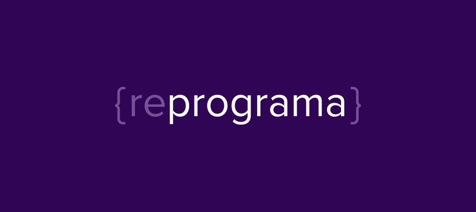

# alunasReprograma

   

## Projeto API Node.js Músicas

Nossa API de alunas do curso Reprograma Back-end Porto 2020.2 poderá:  

- Retornar todas as alunas cadastradas no arquivo alunas.json usando o método Get;
- Retornar uma aluna específica, através do método Get by Id;
- Cadastrar nova aluna usando o método Post;
- Atualizar uma aluna específica, através do uso do método Post by Id;
- Deletar uma aluna específica, através do método Delete;
- Atualizar um valor específico de uma chave/valor usando o método Patch.

 

                                         Por Inácia Simone da Silva